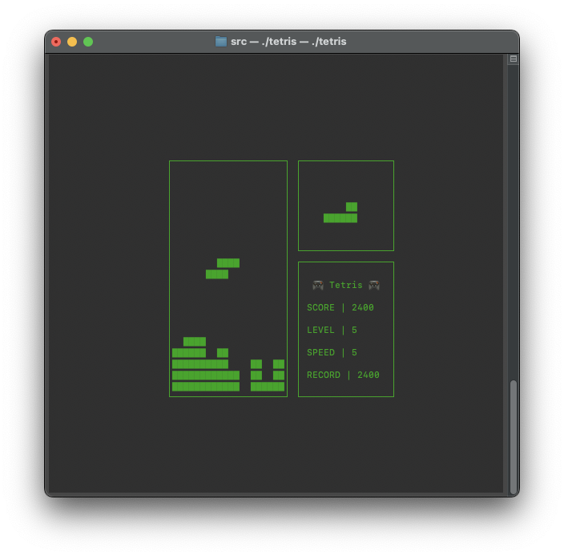
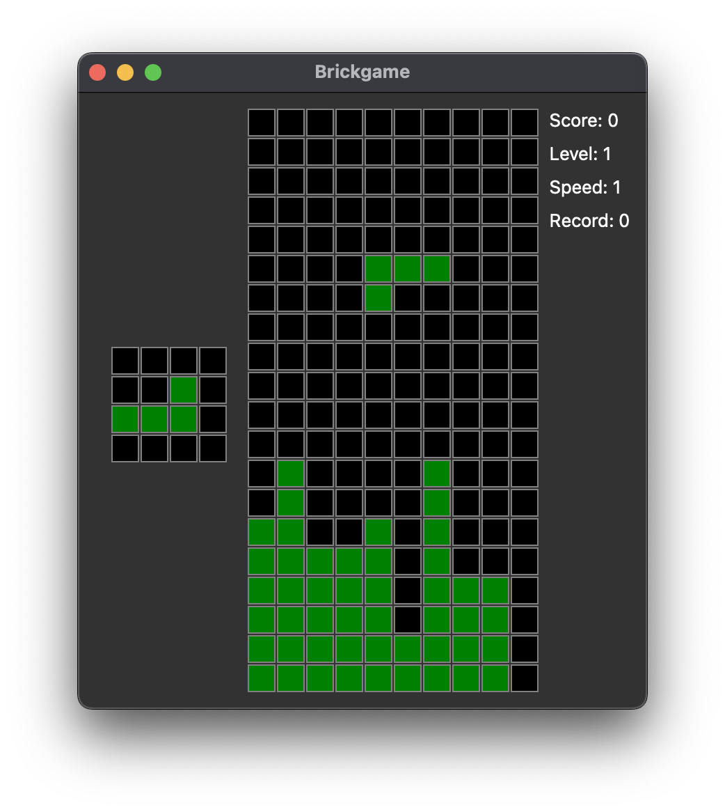
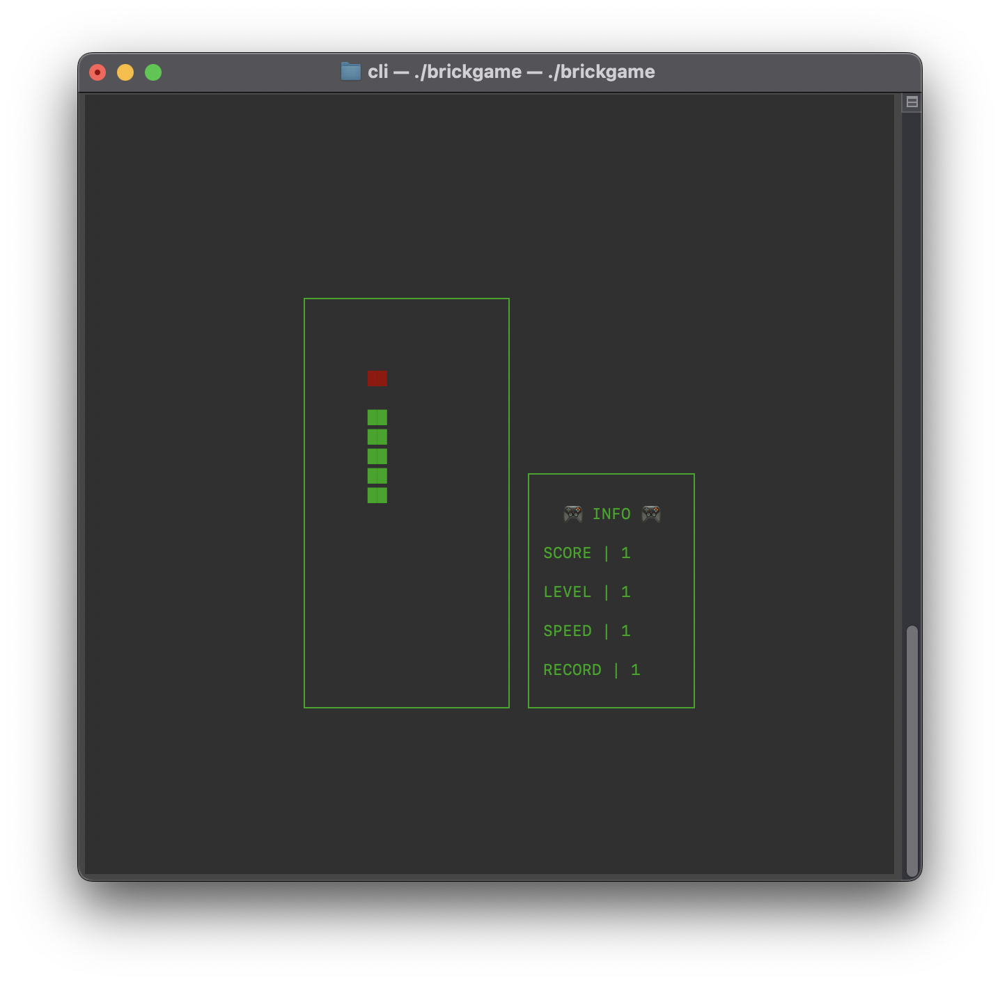
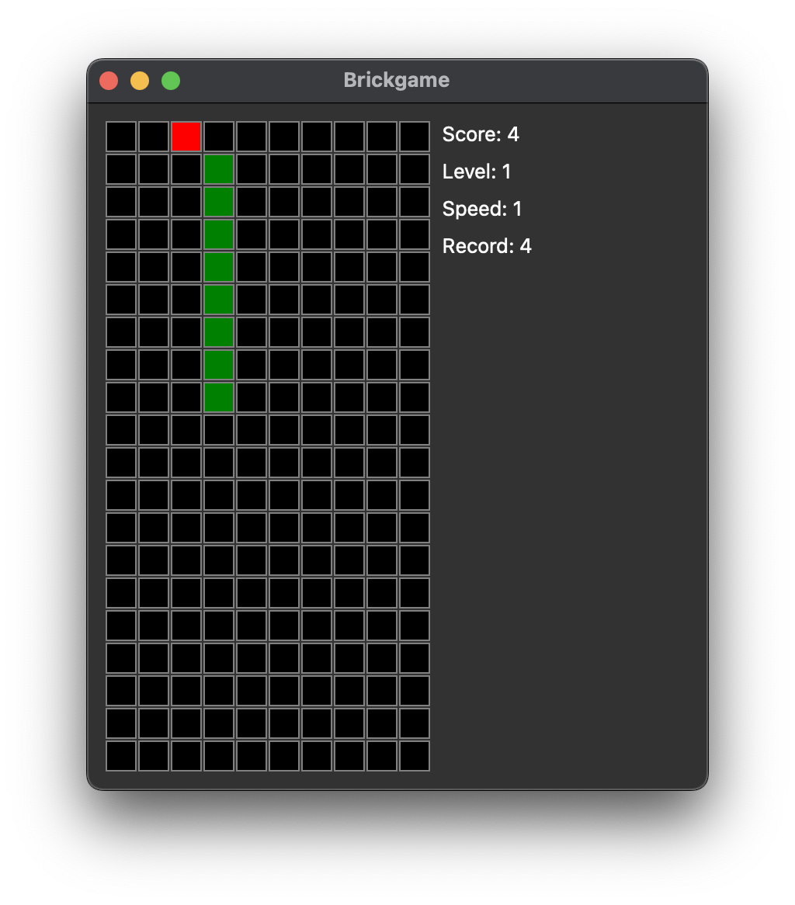
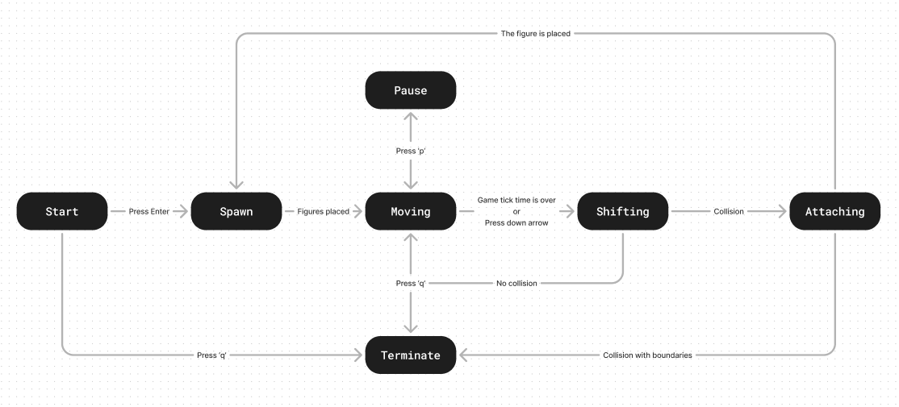
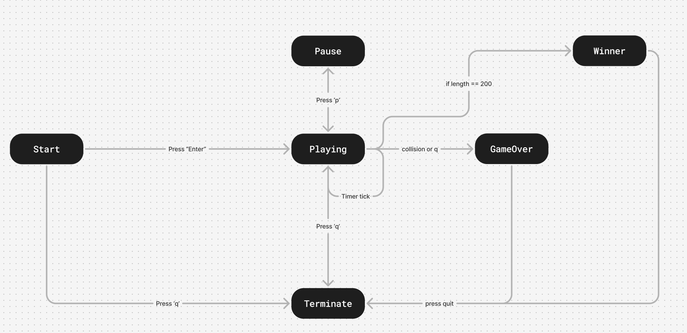

# Brickgame

Implementation of a tetris and snake game. Based on a state machines, the game logic is divided into server-side and client-side components. The project is based on the MVC pattern.

### Languages and Tools
- C11
- C++17
- Ncurses
- Qt framework
- GTest and Check

### Usage
``` make ```
``` ./build/cli/brickgame ``` - CLI version
``` ./build/desktop/brickgame ``` - Desktop version

### Targets
``` make cli ``` - Build CLI version
``` make desktop ``` - Build 
``` make test ``` - Unit testing using the **check** library\
``` make dvi ``` - Creating documentation\
``` make dist ``` - Creating a game archive\

### Screenshots





### FSM diogram


