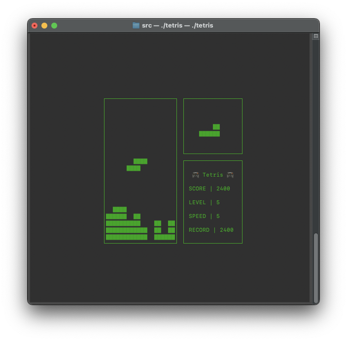
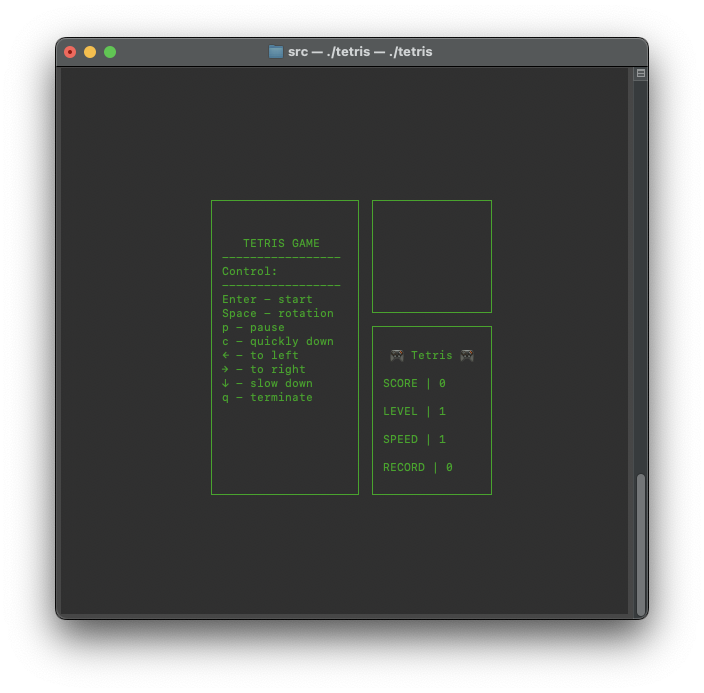
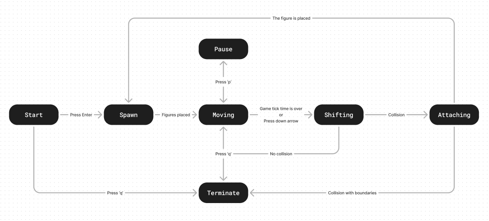

# Brickgame

Implementation of a Tetris library in C, using the ncurses for gui. Based on a state machine, the game logic is divided into server-side and client-side components.

### Usage
``` make && ./tetris ```

### Screenshots



### Targets
``` make test ``` - Unit testing using the **check** library\
``` make gcov_report ``` - Code coverage using **gcov**\
``` make dvi ``` - Creating documentation\
``` make dist ``` - Creating a game archive\
``` make leaks ``` - Checking for memory leaks

### FSM diogram

